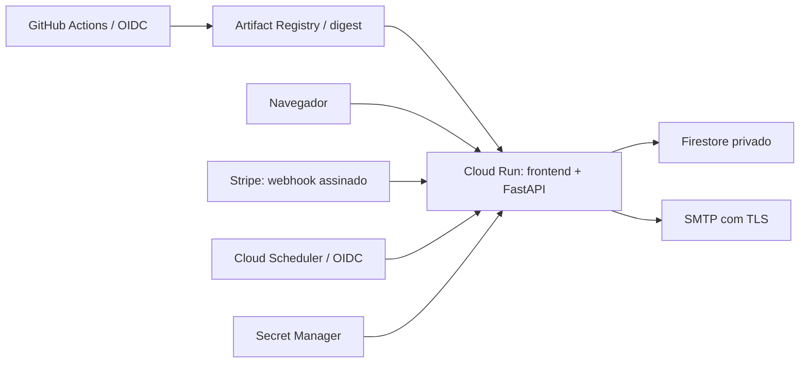

# Deploy: GitHub Actions, Google Cloud e Firebase

Este é o procedimento de lançamento e operação do Fundo Centenário. A aplicação mantém frontend e API na mesma imagem e no mesmo serviço Cloud Run. Firestore é a persistência de produção; Firebase fornece a configuração das regras, índices e emulador desse mesmo banco. Cloud Scheduler processa os agradecimentos durante requisições HTTP autenticadas.

Nenhum recurso de nuvem foi criado automaticamente, nenhuma credencial foi preenchida, nenhum email real foi enviado e nenhum commit/deploy foi realizado durante a preparação. Os comandos abaixo são para o operador executar após revisar o código. Exemplos de terminal usam Bash no Google Cloud Shell; não copie a sintaxe de variáveis diretamente para PowerShell.

### Resultado da revisão antes do lançamento

| Problema identificado | Alteração aplicada | Validação ainda necessária no ambiente real |
|---|---|---|
| JSONL e estado em memória não sobrevivem ao ciclo de vida do Cloud Run | Firestore, transações e intenções idempotentes compartilhadas | IAM, índices ativos e reinício de revisão em staging |
| Emails dependiam de um worker contínuo | Scheduler autenticado, outbox e reserva transacional de envio | Credenciais SMTP, DNS do remetente e execução do job |
| Configuração permitia mock e armazenamento local em produção | Inicialização bloqueia essas combinações, exige HTTPS e Stripe live | Segredos corretos, habilitação dos métodos e webhook test/live |
| Dependências e imagem tinham vulnerabilidades conhecidas | Atualização de versões, lock com hashes e correção da biblioteca Debian | Manter auditorias e atualização da base |
| Não havia pipeline de lançamento | CI e CD com OIDC, imagem por digest, revisão sem tráfego e smoke antes da promoção | Configurar GitHub environments, WIF, IAM e executar o primeiro pipeline |

Os testes locais incluem o emulador Firestore, falha transacional, concorrência, webhook inválido/duplicado, proteção de PII e recuperação do frontend. Build, smoke HTTP, usuário sem privilégios, `PORT` e lint dos workflows foram verificados. Esses checks não substituem o teste Stripe e a validação de IAM/SMTP descritos abaixo.

Validação da preparação em 05/10/2026: 88 testes Python passaram no Windows e no runtime Linux, com emulador Firestore; os dois checks Node passaram. `pip-audit` não encontrou vulnerabilidades conhecidas no lock, e Trivy não encontrou HIGH/CRITICAL com correção disponível na imagem construída. `actionlint`, `pip check`, conferência do lock, Compose e `git diff --check` passaram. Não houve execução remota dos workflows nem teste de cobrança/SMTP com credenciais reais.

## 1. Arquitetura e invariantes



- O browser nunca comprova pagamento. Apenas o webhook Stripe validado confirma contribuições.
- Cartões ficam no Checkout hospedado. Nome, email e CPF não entram na metadata Stripe.
- Intenções persistidas não contêm questionário. O browser mantém o questionário em `sessionStorage` e chama `/finalize` depois do pagamento confirmado.
- O cadastro do doador só é criado depois da confirmação, com autenticação pelo token da contribuição. O registro é criado uma vez, em transação.
- A primeira confirmação, a fatura recorrente e a outbox são gravadas em uma transação. IDs de documento determinísticos e transações coordenam instâncias distintas.
- Emails são processados somente quando existe pagamento e cadastro confirmado. Nenhum endpoint aceita destinatário/conteúdo arbitrários.
- `STORAGE_BACKEND=local` e o PSP mock são exclusivos de desenvolvimento/testes. Produção e staging exigem Firestore e Stripe; produção exige modo live, staging usa chaves test.

O modo local continua disponível por `docker compose up --build`, com volume local privado e recarga automática. Não implante esse Compose no Google Cloud.

## 2. Decisões antes de criar recursos

1. Escolha dois projetos distintos: staging e produção. Isso separa dados, identidades, segredos e configurações Stripe.
2. Vincule faturamento e configure alertas de orçamento em ambos. Limites de instâncias reduzem exposição, mas não constituem limite financeiro absoluto.
3. Escolha a região antes de criar o banco. Exemplo: `southamerica-east1`, com Firestore e Cloud Run próximos. Verifique disponibilidade e exigências institucionais de localização dos dados.
4. Use inicialmente a URL HTTPS nativa do Cloud Run como origem pública. Configure domínio próprio posteriormente, testando webhooks e redirecionamentos novamente.
5. Defina responsável por incidentes, reconciliação, cancelamentos, reembolsos e acesso aos dados. Configure finalidade e retenção do CPF, política de privacidade e contato de atendimento antes de divulgar o formulário.
6. Defina um remetente SMTP autorizado. Configure SPF, DKIM e DMARC no provedor/domínio e teste entrega em contas controladas pela equipe.

Não são necessários Kubernetes, Redis, Celery, uma segunda aplicação frontend, Firebase Authentication ou Firebase Admin SDK. Não instale um SDK Firebase no navegador para acessar dados de doadores.

## 3. Preparar Google Cloud e Firebase

Execute para cada ambiente, substituindo os valores:

```bash
export PROJECT="SEU_PROJECT_ID"
export REGION="southamerica-east1"
export SERVICE="fundo-centenario"
export REPOSITORY="fundo-images"
export RUNTIME_SA="fundo-runtime@$PROJECT.iam.gserviceaccount.com"
export DEPLOY_SA="fundo-deploy@$PROJECT.iam.gserviceaccount.com"
export SCHEDULER_SA="fundo-scheduler@$PROJECT.iam.gserviceaccount.com"

gcloud config set project "$PROJECT"
gcloud services enable run.googleapis.com artifactregistry.googleapis.com firestore.googleapis.com secretmanager.googleapis.com cloudscheduler.googleapis.com iam.googleapis.com iamcredentials.googleapis.com sts.googleapis.com cloudresourcemanager.googleapis.com
gcloud artifacts repositories create "$REPOSITORY" --repository-format=docker --location="$REGION"
gcloud iam service-accounts create fundo-runtime
gcloud iam service-accounts create fundo-deploy
gcloud iam service-accounts create fundo-scheduler
```

No Firebase Console, adicione Firebase **ao projeto Google Cloud já escolhido**. Em Build → Firestore Database, crie `(default)` em modo Native/Standard, com regras de produção e a região escolhida. Não crie outro projeto Firebase por engano e não habilite acesso público ao banco.

O servidor usa Application Default Credentials e sua service account. Regras Firebase bloqueiam SDKs clientes; elas não substituem IAM para os SDKs de servidor. Conceda acesso mínimo à identidade runtime:

```bash
gcloud projects add-iam-policy-binding "$PROJECT" --member="serviceAccount:$RUNTIME_SA" --role=roles/datastore.user
gcloud iam service-accounts add-iam-policy-binding "$RUNTIME_SA" --member="serviceAccount:$DEPLOY_SA" --role=roles/iam.serviceAccountUser
gcloud artifacts repositories add-iam-policy-binding "$REPOSITORY" --location="$REGION" --member="serviceAccount:$DEPLOY_SA" --role=roles/artifactregistry.writer
```

`roles/datastore.user` permite operações de dados no projeto. Por isso, staging e produção devem estar separados e esse principal não deve receber acesso a outros projetos. Não conceda Owner/Editor às identidades da aplicação ou do pipeline. [Identidade de serviço](https://docs.cloud.google.com/run/docs/configuring/services/service-identity).

### Regras, índices e TTL

Na raiz do repositório, com uma conta administrativa autorizada:

```bash
npx --yes firebase-tools@15.32.1 login
npx --yes firebase-tools@15.32.1 deploy --project "$PROJECT" --only firestore:rules,firestore:indexes
```

Arquivos versionados:

- `firebase.json`: configuração Firestore e emulador; não contém ID fixo de projeto.
- `firestore.rules`: nega todo acesso de clientes.
- `firestore.indexes.json`: índice de seleção dos emails, TTL para pendências e rate limits, e exclusão de índices desnecessários de PII/tokens.

Confirme no Console que o índice `fundo_thank_you_outbox` (`state`, `next_attempt_at`) terminou de construir antes de habilitar emails. Confirme também que as políticas TTL em `fundo_pending.expires_at` e `fundo_rate_limits.expires_at` estão ativas. TTL é limpeza assíncrona; a aplicação verifica expiração sem depender da exclusão física. Não configure TTL em confirmações ou cadastro sem uma política de retenção aprovada. [Índices](https://firebase.google.com/docs/firestore/query-data/indexing), [TTL](https://firebase.google.com/docs/firestore/ttl).

O prefixo padrão é `fundo_`. Se mudar `FIRESTORE_PREFIX`, ajuste os grupos de coleção do arquivo de índices/TTL antes do deploy. O workflow usa o prefixo padrão e o banco `(default)`.

## 4. Segredos e Stripe

Crie os segredos no Secret Manager Console, colocando cada valor diretamente na interface e criando sua primeira versão:

| Segredo | Conteúdo | Necessário |
|---|---|---|
| `stripe-secret-key` | Chave secreta/restrita da conta correta | Sempre |
| `stripe-webhook-secret` | Segredo do destino de webhook desse ambiente | Sempre |
| `smtp-username` | Usuário do remetente SMTP | Com email habilitado |
| `smtp-password` | Senha/app password do remetente | Com email habilitado |

Em staging use Stripe test; em produção use live. Nunca reutilize o segredo da Stripe CLI como segredo do endpoint de produção. Não escreva os valores em comandos, YAML, arquivos versionados, Docker build args ou GitHub Variables.

Conceda ao runtime acesso a cada segredo necessário, sem acesso indiscriminado ao projeto:

```bash
gcloud secrets add-iam-policy-binding stripe-secret-key --member="serviceAccount:$RUNTIME_SA" --role=roles/secretmanager.secretAccessor
gcloud secrets add-iam-policy-binding stripe-webhook-secret --member="serviceAccount:$RUNTIME_SA" --role=roles/secretmanager.secretAccessor
# Execute estes dois somente se o remetente estiver configurado:
gcloud secrets add-iam-policy-binding smtp-username --member="serviceAccount:$RUNTIME_SA" --role=roles/secretmanager.secretAccessor
gcloud secrets add-iam-policy-binding smtp-password --member="serviceAccount:$RUNTIME_SA" --role=roles/secretmanager.secretAccessor
```

Cadastre o destino Stripe em `https://SUA_ORIGEM/api/webhooks/stripe`, com snapshot events da própria conta, API `2026-09-30.endive` e eventos listados em [INTEGRATION.md](INTEGRATION.md). Confirme habilitação de Pix na conta antes de divulgá-lo. Mantenha versão da API, segredo e modo test/live alinhados.

As versões de segredos são numéricas e fixadas no deploy. Para rotacionar, crie uma nova versão, atualize as GitHub Variables correspondentes e implante nova revisão. Preserve versões antigas enquanto puder ser necessário rollback; revogue credenciais comprometidas independentemente dessa política. [Segredos no Cloud Run](https://docs.cloud.google.com/run/docs/configuring/services/secrets).

## 5. Primeiro serviço Cloud Run: bootstrap administrativo

O workflow de CD exige um serviço já existente. O bootstrap é feito uma vez por um administrador, separado do deploy rotineiro.

Construa e publique a primeira imagem revisada:

```bash
gcloud auth configure-docker "$REGION-docker.pkg.dev" --quiet
export IMAGE="$REGION-docker.pkg.dev/$PROJECT/$REPOSITORY/fundo:bootstrap-1"
docker build --platform linux/amd64 -t "$IMAGE" .
docker push "$IMAGE"
```

Para obter a URL inicial, crie o serviço **privado**, sem PSP real, sem email, e sem autorização de confirmação mock:

```bash
gcloud run deploy "$SERVICE" --region "$REGION" --image "$IMAGE" --service-account "$RUNTIME_SA" --port 8000 --no-allow-unauthenticated --set-env-vars APP_ENV=development,STORAGE_BACKEND=local,PAYMENT_PROVIDER=mock,ENABLE_MOCK_PSP=false,EMAIL_ENABLED=false --max-instances 1 --quiet
export RUN_URL="$(gcloud run services describe "$SERVICE" --region "$REGION" --format='value(status.url)')"
```

Não publique essa revisão de bootstrap. Ela serve somente para reservar o serviço/URL. Escolha `PUBLIC_BASE_URL=$RUN_URL` inicialmente, cadastre o webhook Stripe, complete os segredos e prepare um arquivo `runtime.json` temporário com valores **não secretos**:

```json
{
  "APP_ENV": "staging",
  "STORAGE_BACKEND": "firestore",
  "GOOGLE_CLOUD_PROJECT": "SEU_PROJECT_ID",
  "FIRESTORE_DATABASE": "(default)",
  "FIRESTORE_PREFIX": "fundo_",
  "PUBLIC_BASE_URL": "https://URL_NATIVA_DO_SERVICO",
  "CORS_ORIGINS": "https://URL_NATIVA_DO_SERVICO",
  "PAYMENT_PROVIDER": "stripe",
  "ENABLE_MOCK_PSP": "false",
  "STRIPE_LIVE_MODE": "false",
  "EMAIL_ENABLED": "false",
  "SCHEDULER_AUDIENCE": "https://URL_NATIVA_DO_SERVICO",
  "SCHEDULER_SERVICE_ACCOUNT": "fundo-scheduler@SEU_PROJECT_ID.iam.gserviceaccount.com",
  "INTENT_LIMIT_PER_MINUTE": "60",
  "EMAIL_BATCH_SIZE": "10"
}
```

Em produção altere `APP_ENV` para `production`, `STRIPE_LIVE_MODE` para `true` e use os segredos live do projeto de produção. Não copie as credenciais test desse exemplo para o lançamento live.

```bash
gcloud run deploy "$SERVICE" --region "$REGION" --image "$IMAGE" --service-account "$RUNTIME_SA" --port 8000 --env-vars-file runtime.json --set-secrets STRIPE_SECRET_KEY=stripe-secret-key:1,STRIPE_WEBHOOK_SECRET=stripe-webhook-secret:1 --memory 512Mi --cpu 1 --concurrency 20 --min-instances 0 --max-instances 3 --timeout 180 --quiet
```

Antes de tornar público, faça smoke test com uma identidade humana que tenha `roles/run.invoker` no serviço:

```bash
export SMOKE_ID_TOKEN="$(gcloud auth print-identity-token)"
python tools/smoke.py "$RUN_URL" --production
unset SMOKE_ID_TOKEN
```

O parâmetro `--production` do smoke verifica proteções HTTP e métodos Stripe tanto em staging quanto em produção; não realiza cobrança.

Somente depois do teste, permita a invocação pública do site e dos webhooks. Um administrador pode executar:

```bash
gcloud run services add-iam-policy-binding "$SERVICE" --region "$REGION" --member=allUsers --role=roles/run.invoker
gcloud run services add-iam-policy-binding "$SERVICE" --region "$REGION" --member="serviceAccount:$DEPLOY_SA" --role=roles/run.developer
```

Se a política da organização impedir `allUsers`, resolva a exposição pública com o administrador de rede/IAM antes de liberar o formulário. Não torne dados do Firestore públicos para contornar isso. O endpoint de emails continua protegido na aplicação, pois IAM do serviço público não distingue rotas.

## 6. GitHub: proteção e autenticação federada

No repositório, habilite Actions e crie os environments `staging` e `production`. Restrinja deploys à branch `main`, exija revisão de PR e torne o check `CI / check` obrigatório. Configure revisores no environment de produção quando disponíveis no seu plano. Esses controles são configurações do GitHub e não são ativados apenas por adicionar YAML.

O código adiciona:

- `.github/workflows/ci.yml`: testes em ambiente isolado, emulador Firestore, checks frontend, Compose, lock, auditoria de dependências, build e smoke test da imagem, scan de vulnerabilidades do container.
- `.github/workflows/deploy.yml`: CI obrigatório, OIDC, build/smoke/publicação da mesma imagem, implantação por digest em revisão candidata sem tráfego, verificação de prontidão e promoção da revisão específica.
- `.github/dependabot.yml`: acompanhamento semanal de dependências, imagens e Actions.

PRs não recebem identidade Google nem acesso a produção. Actions são fixadas por SHA; o job de deploy solicita somente `contents: read` e `id-token: write`. A service account de deploy não precisa ler valores dos segredos ou dados de doadores.

### Workload Identity Federation

Obtenha os IDs numéricos do repositório e de seu proprietário no GitHub. Crie pool/provider no projeto de cada ambiente com restrições ao repositório, branch e environment. Exemplo para produção:

```bash
export PROJECT_NUMBER="$(gcloud projects describe "$PROJECT" --format='value(projectNumber)')"
export REPOSITORY_ID="ID_NUMERICO_DO_REPOSITORIO"
export OWNER_ID="ID_NUMERICO_DO_PROPRIETARIO"

gcloud iam workload-identity-pools create github --location=global --display-name="GitHub deployments"
gcloud iam workload-identity-pools providers create-oidc github --location=global --workload-identity-pool=github --issuer-uri=https://token.actions.githubusercontent.com --attribute-mapping="google.subject=assertion.sub,attribute.repository_id=assertion.repository_id,attribute.repository_owner_id=assertion.repository_owner_id" --attribute-condition="assertion.repository_id=='$REPOSITORY_ID' && assertion.repository_owner_id=='$OWNER_ID' && assertion.ref=='refs/heads/main' && assertion.environment=='production'"
gcloud iam service-accounts add-iam-policy-binding "$DEPLOY_SA" --role=roles/iam.workloadIdentityUser --member="principalSet://iam.googleapis.com/projects/$PROJECT_NUMBER/locations/global/workloadIdentityPools/github/attribute.repository_id/$REPOSITORY_ID"
```

No projeto staging, use `assertion.environment=='staging'`. Não remova as restrições para corrigir um erro de autenticação; confira os IDs, a branch e o environment do job. [Guia oficial de WIF](https://docs.cloud.google.com/iam/docs/workload-identity-federation-with-deployment-pipelines).

### Variables por environment

Em Settings → Environments → environment → Environment variables:

| Variable | Exemplo/finalidade |
|---|---|
| `GCP_PROJECT_ID` | ID do projeto desse ambiente |
| `GCP_REGION` | `southamerica-east1` |
| `CLOUD_RUN_SERVICE` | `fundo-centenario` |
| `ARTIFACT_REPOSITORY` | `fundo-images` |
| `GCP_WIF_PROVIDER` | `projects/NUMERO/locations/global/workloadIdentityPools/github/providers/github` |
| `DEPLOY_SERVICE_ACCOUNT` | Email de `fundo-deploy` |
| `RUNTIME_SERVICE_ACCOUNT` | Email de `fundo-runtime` |
| `PUBLIC_BASE_URL` | Origem HTTPS, sem caminho/query, sem barra final |
| `CLOUD_RUN_URL` | URL nativa HTTPS estável do serviço; audience do Scheduler |
| `SCHEDULER_SERVICE_ACCOUNT` | Email de `fundo-scheduler` |
| `EMAIL_ENABLED` | `false` no primeiro deploy; `true` após testar remetente e Scheduler |
| `SMTP_HOST` | Host SMTP; obrigatório quando email estiver ativo |
| `EMAIL_FROM_ADDRESS` | Remetente autorizado |
| `EMAIL_REPLY_TO` | Atendimento; opcional |
| `STRIPE_SECRET_VERSION` | Versão numérica do segredo; padrão `1` |
| `STRIPE_WEBHOOK_SECRET_VERSION` | Versão numérica; padrão `1` |
| `SMTP_SECRET_VERSION` | Mesma versão numérica para usuário e senha SMTP; padrão `1` |

Não coloque chaves/senhas nessas Variables. O workflow usa STARTTLS/587 por padrão; se o provedor exigir SSL/465, altere os dois valores do bloco `env` em conjunto e revise o deploy. Texto, assunto e template têm defaults no backend e podem ser personalizados no mesmo bloco sem adicionar dados secretos.

Após configurar e publicar manualmente as alterações revisadas no GitHub, use Actions → Deploy Cloud Run → Run workflow → `staging`. Faça a validação Stripe antes de promover produção. Push aprovado em `main` solicita deploy de produção; proteção do environment determina quando ele executa.

Se o smoke da candidata falhar, o workflow não altera o tráfego existente. Investigue a revisão candidata e remova sua tag após diagnóstico. Não promova manualmente uma candidata sem entender a falha. [Rollouts e rollback](https://docs.cloud.google.com/run/docs/rollouts-rollbacks-traffic-migration).

## 7. Scheduler e ativação dos emails

O worker permanente só roda no modo local. No Firestore, a outbox é consultada e processada durante `POST /api/internal/emails/process`. O handler verifica assinatura/issuer do token Google, audience, email e `email_verified`. Não confia em headers `X-CloudScheduler-*` como autenticação.

Crie o job antes de habilitar envio:

```bash
gcloud scheduler jobs create http fundo-thank-you --location="$REGION" --schedule="* * * * *" --time-zone="America/Sao_Paulo" --uri="$RUN_URL/api/internal/emails/process" --http-method=POST --oidc-service-account-email="$SCHEDULER_SA" --oidc-token-audience="$RUN_URL" --attempt-deadline=180s --max-retry-attempts=3
```

O operador que cria o job precisa de permissão para usar essa service account. Preserve o papel de service agent do Cloud Scheduler; não entregue uma chave JSON ao job. Como o serviço é público, a verificação por rota ocorre no código. [Scheduler com Cloud Run](https://docs.cloud.google.com/run/docs/triggering/using-scheduler).

No runtime confira `SCHEDULER_AUDIENCE=$RUN_URL` e `SCHEDULER_SERVICE_ACCOUNT=$SCHEDULER_SA`. Preencha remetente e segredos, altere `EMAIL_ENABLED=true` no environment e faça novo deploy. Execute o job manualmente pelo Console somente quando houver uma contribuição de teste autorizada no projeto staging.

Cada execução seleciona até 10 registros e para de iniciar novos envios após 50 segundos. Cada registro tem lease de 5 minutos, aquisição transacional e retries com atraso limitado a uma hora. Uma requisição sem cadastro confirmado adia o job; nunca envia o questionário antes do pagamento. O retry pode continuar após reinício ou troca de instância.

SMTP não garante entrega exatamente uma vez. Se aceitar o email e o processo encerrar antes de registrar o envio, o retry pode duplicá-lo; `Message-ID` é estável. Aceitação SMTP não comprova entrega na caixa de entrada. Uma garantia maior exige serviço de email com idempotência, não apenas outro lock.

## 8. Migração dos JSONL existentes

Não envie os dados locais ao GitHub ou ao build Docker. O modo Firestore não lê/migra `backend/data` automaticamente.

1. Pause novas contribuições no sistema anterior e deixe os pagamentos pendentes serem conciliados. Os registros antigos em memória não serão transferidos; não desligue o processo sem planejar sua recuperação.
2. Faça backup privado dos JSONL, restrito e criptografado. Mantenha uma cópia imutável para recuperação.
3. Reconcile pagamentos e assinaturas com a conta Stripe correta. Não importe pagamentos mock ou registros sem comprovação. Assinaturas anteriores sem metadata exigem reconciliação específica conforme `INTEGRATION.md`.
4. Instale as dependências em um ambiente isolado e obtenha ADC com uma identidade administrativa temporária autorizada.
5. Valide primeiro uma cópia protegida do backup, sem acesso remoto:

```bash
python tools/migrate_jsonl.py --source /CAMINHO_PRIVADO/backup
```

6. Teste a importação no projeto staging antes de produção. Para aplicar a fonte já conciliada:

```bash
gcloud auth application-default login
python tools/migrate_jsonl.py --source /CAMINHO_PRIVADO/backup --project "$PROJECT" --apply --confirmed-source
```

O comando preserva IDs, primeira confirmação, faturas, cadastro e marcadores de email enviado. É idempotente; pode ser repetido após falha parcial. Ele não chama SMTP e não cria novos emails retroativos. Para preservar explicitamente pedidos de email ainda pendentes da fonte, acrescente `--include-pending-emails` depois de revisar os destinatários/estado. Nunca importe um backup de staging/testes em produção.

Compare contagens e amostras de referências com a fonte e a Stripe, sem copiar PII para logs. Registros de cadastro devem possuir confirmação correspondente. Não restaure o banco inteiro depois de novos pagamentos sem reconciliar os eventos posteriores; isso pode desfazer deduplicação.

## 9. Verificação de lançamento e operação

Antes de divulgar:

- CI verde, regras e índices publicados, TTL confirmado, service accounts e WIF restritos.
- Smoke público e prontidão do Firestore funcionando; produção sem mock, docs/OpenAPI públicos ou emulator.
- No staging: Pix, cartão pontual e mensal via Checkout real de teste, assinatura inválida rejeitada, webhook repetido sem duplicata, renovação, retorno do navegador e recuperação após reinício.
- Envio SMTP de teste e retry verificados em destinatários controlados, com cadastro confirmado antes do envio.
- No live: habilitação dos meios na conta, configuração de webhook, chaves e versão conferidas por responsável. Qualquer pagamento live de validação deve ser autorizado e conciliado.
- Política de privacidade e atendimento acessíveis, procedimento de cancelamento pela Stripe definido, responsáveis e backups estabelecidos.

Configure alertas no Cloud Monitoring/Logging para disponibilidade, aumento de 5xx/429, falhas de webhook, falhas do Scheduler, mensagem `Agradecimento pendente` e tamanho/idade da outbox. Revise também confirmações sem cadastro; a perda da sessão do navegador pode deixar um pagamento confirmado aguardando identificação. Não capture bodies, CPF, emails, tokens ou Authorization em logs/analytics.

O limite atual de 60 criações por minuto é global e compartilhado pelo Firestore. Ele limita sessões no PSP sem guardar IP. Um ataque pode consumir esse orçamento e bloquear temporariamente doadores; se necessário, adicione rate limiting por cliente em uma borda confiável, com política de privacidade, sem confiar cegamente em `X-Forwarded-For` enviado pelo cliente.

Configure backups gerenciados/PITR do Firestore conforme retenção aprovada, acesso restrito e recuperação testada em outro banco/projeto. Para exportações, use bucket privado, sem acesso público, com lifecycle e identidade administrativa separada do runtime. [Exportação/importação](https://docs.cloud.google.com/firestore/native/docs/manage-data/export-import).

O CI bloqueia vulnerabilidades conhecidas dos pacotes Python e vulnerabilidades HIGH/CRITICAL com correção disponível na imagem. Vulnerabilidades do sistema ainda sem correção exigem acompanhamento; não são silenciosamente tratadas como ausência de risco. Atualize digest base e lock regularmente, sem desabilitar os gates para lançar.

O Dockerfile atualiza temporariamente `libpcre2-8-0` para `10.46-1~deb13u3`, corrigindo [CVE-2026-103111](https://security-tracker.debian.org/tracker/CVE-2026-103111) na base fixada. Ao atualizar o digest, confira a versão da biblioteca na nova base e remova esse pin se ela já incluir a correção ou versão posterior; não faça downgrade para preservar o pin.

### Rollback

Localize a revisão estável no Console e encaminhe o tráfego explicitamente:

```bash
gcloud run services update-traffic "$SERVICE" --region "$REGION" --to-revisions REVISAO_ESTAVEL=100
```

Não restaure dados para fazer rollback de código. Preserve esquema e versões de segredos compatíveis. A versão antiga baseada em JSONL não é um rollback válido depois da migração para Firestore. Pause o Scheduler se o incidente envolver emails; não desative o webhook sem planejar a recuperação dos eventos Stripe.

### Domínio próprio e Firebase Hosting opcional

Firebase Hosting não é necessário no caminho padrão. Firebase já participa pelo Firestore. Se optar por Hosting para domínio próprio/HTTPS, use um diretório público vazio e rewrite de todas as rotas para o mesmo serviço Cloud Run; assim a imagem continua sendo a única fonte de frontend e backend. Configure o bloco `hosting` e deploy do router separadamente, mantendo `/api/*`, `/como-apoiar/` e `/` na mesma origem.

Atualize `PUBLIC_BASE_URL`, `CORS_ORIGINS` e o destino Stripe para a nova origem. Preserve a audience do Scheduler na URL nativa. Verifique região suportada, limites de timeout/tamanho e headers dos rewrites antes de adotar essa opção. Não publique uma segunda cópia desatualizada de `frontend/` por fora do pipeline.

## 10. Manutenção e testes locais

Runtime Linux/Python 3.12 usa `backend/requirements.lock`, com versões e hashes. Após alterar `backend/requirements.txt`, gere o lock novamente em Linux e revise o diff; Dependabot não dispensa essa revisão:

```bash
docker run --rm -v "$PWD:/workspace:ro" -w /workspace python:3.12-slim@sha256:02108f5d322dd89f1c9e552442c25acb0543dfdbc455693a5599624f20d9155d python tools/lock_requirements.py > backend/requirements.lock
python tools/lock_requirements.py --check
```

Em Windows, use `requirements.txt` para o venv local, pois o lock é resolvido para Linux. A imagem e o CI sempre usam o lock. Não gere o arquivo com redirecionamento UTF-16 do PowerShell antigo; use Bash ou capture stdout em Python e grave UTF-8.

Para testar persistência remota localmente, inicie o emulator e execute os testes com um projeto fictício:

```bash
docker run --rm -p 127.0.0.1:8085:8085 gcr.io/google.com/cloudsdktool/google-cloud-cli:emulators@sha256:8d8573471c489a409f03891d2c24d177fa531276184f7002b9a2d853d1b3ed54 gcloud emulators firestore start --host-port=0.0.0.0:8085 --project=demo-fundo-centenario
# Em outro terminal, no venv:
pip install -r backend/requirements.txt -r backend/requirements-dev.txt
FIRESTORE_TEST_HOST=127.0.0.1:8085 REQUIRE_FIRESTORE_TESTS=1 python -m pytest -q
node tests/frontend-static.test.js
node tests/donation-steps.test.js
```

Sem emulator, os testes locais de Firestore são pulados; o CI exige sua execução. Os testes usam dados sintéticos e desabilitam a leitura de `.env`, sem cobrar cartões nem enviar emails reais. O emulator não reproduz IAM, regras de SDK cliente, construção de índices, billing ou todos os comportamentos do serviço gerenciado: valide esses itens no staging antes do live.
